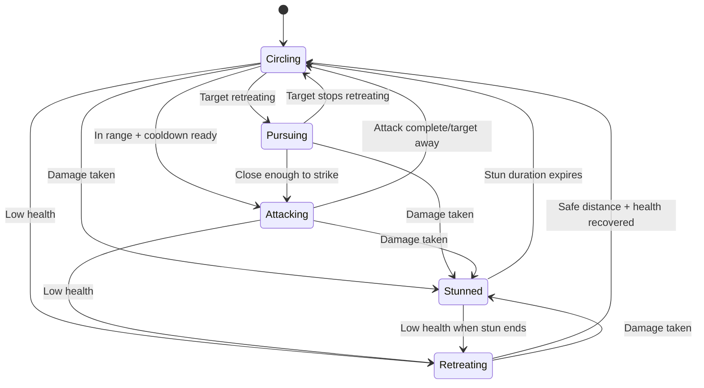

# AI Fighter State Machine

The AI fighter system in 33 Duels implements a sophisticated state machine that governs combat behavior. Each fighter AI entity operates independently, making decisions based on target proximity, health status, and target movement patterns.

## Overview

The AI system is built around the `AIFighter` component and the `sys_ai_fighter` system, providing dynamic combat behavior that scales with movement speed and adapts to different combat scenarios.

### Core Components

- **Component**: `com_ai_fighter.ts` - Defines AI state and properties
- **System**: `sys_ai_fighter.ts` - Implements state machine logic
- **States**: Five distinct behavioral states with clear transitions

## AI States

### 1. Circling 🔄
**Default combat state** - Fighters orbit their target at a safe distance, looking for attack opportunities.

**Behavior:**
- Moves in circular patterns around the target
- Maintains optimal engagement distance
- Randomly changes direction for unpredictability
- Occasionally spirals inward for dramatic tension

**Transitions:**
- → **Pursuing**: When target starts retreating
- → **Attacking**: When within dash range + random chance + cooldown ready
- → **Retreating**: When health drops to low threshold
- → **Stunned**: When taking damage

### 2. Pursuing 🏃‍♂️
**Aggressive chase state** - Direct pursuit of retreating targets with no circling.

**Behavior:**
- Moves directly toward retreating target
- 1.2x movement speed multiplier for faster pursuit
- Shorter attack cooldowns (1.0-1.5s vs 2.0-3.5s)
- No circular movement - pure aggression

**Transitions:**
- → **Attacking**: When close enough to strike
- → **Circling**: When target stops retreating
- → **Stunned**: When taking damage

### 3. Attacking ⚔️
**Combat engagement state** - High-speed dash attacks toward the target.

**Behavior:**
- Direct movement toward target at high speed
- Speed multiplier capped to prevent overshooting at high base speeds
- Duration scales inversely with movement speed
- Activates weapon systems when in range

**Transitions:**
- → **Circling**: After attack duration expires or target moves away
- → **Stunned**: When taking damage
- → **Retreating**: When health drops to low threshold

### 4. Retreating 🛡️
**Defensive state** - Moves away from threats when health is low.

**Behavior:**
- Moves directly away from target
- Triggered when health ≤ 1 HP
- Maintains distance until health recovers

**Transitions:**
- → **Circling**: When at safe distance AND health > low threshold
- → **Stunned**: When taking damage

### 5. Stunned 😵
**Temporary incapacitation** - Brief immobilization after taking damage.

**Behavior:**
- No movement for short duration (0.3 seconds, scaled by speed)
- Provides combat rhythm and counterplay opportunities
- Duration scales with movement speed to maintain consistent feel

**Transitions:**
- → **Circling**: After stun duration expires (unless other conditions apply)
- → **Retreating**: If health is low when stun ends

## Speed Scaling System

The AI system automatically adapts to different movement speeds to maintain consistent gameplay feel:

### Distance Scaling
All distance thresholds scale proportionally with movement speed:
```typescript
let speed_scale = move.MoveSpeed / BASE_MOVE_SPEED; // BASE_MOVE_SPEED = 2.0
let scaled_distances = {
    circle: BASE_CIRCLE_DISTANCE * speed_scale,           // 2.0 → 6.0 at 3x speed
    dash_trigger: BASE_DASH_TRIGGER_DISTANCE * speed_scale, // 2.5 → 7.5 at 3x speed
    retreat: BASE_RETREAT_DISTANCE * speed_scale          // 4.0 → 12.0 at 3x speed
};
```

### Time Scaling
State durations scale inversely with speed using square root to moderate the effect:
```typescript
let time_scale = 1.0 / Math.sqrt(speed_scale);
```

This ensures that:
- Faster fighters have shorter state transitions
- Combat pacing remains consistent
- AI responsiveness scales appropriately

### Dash Speed Capping
Attack movement speed is capped to prevent overshooting:
```typescript
let effective_multiplier = Math.min(
    BASE_DASH_SPEED_MULTIPLIER, 
    BASE_DASH_SPEED_MULTIPLIER / Math.sqrt(speed_scale)
);
```

## Retreat Detection

The AI uses vector dot product calculation to detect when targets are retreating:

```typescript
let target_movement: Vec2 = [target_move.Direction[0], target_move.Direction[1]];
let dot_product = target_movement[0] * to_target[0] + target_movement[1] * to_target[1];
let is_target_retreating = dot_product < -0.3; // Threshold to avoid false positives
```

When retreat is detected:
- **Circling** state immediately transitions to **Pursuing**
- No more defensive circling - pure aggression
- Faster movement and shorter cooldowns

## Victory Behavior

When no valid targets remain (all enemies defeated):
- AI stops all movement completely
- Provides clean victory pose
- Ready for future victory animation integration

## State Transition Diagram



## Key Parameters

| Parameter | Base Value | Description |
|-----------|------------|-------------|
| `BASE_CIRCLE_DISTANCE` | 2.0 | Preferred circling radius |
| `BASE_DASH_TRIGGER_DISTANCE` | 2.5 | Attack initiation range |
| `BASE_RETREAT_DISTANCE` | 4.0 | Safe retreat distance |
| `LOW_HEALTH_THRESHOLD` | 1 | Health trigger for retreat |
| `BASE_DASH_SPEED_MULTIPLIER` | 3.0 | Attack speed boost |
| `BASE_MOVE_SPEED` | 2.0 | Reference speed for scaling |

## Implementation Notes

- All states check for target validity (alive enemies)
- State changes are logged for debugging
- Attack cooldowns prevent spam behavior
- Random elements add unpredictability
- System designed for hackability and easy modification

The AI state machine provides engaging, dynamic combat that feels responsive at any movement speed while maintaining clear, predictable behavior patterns that players can learn and counter.