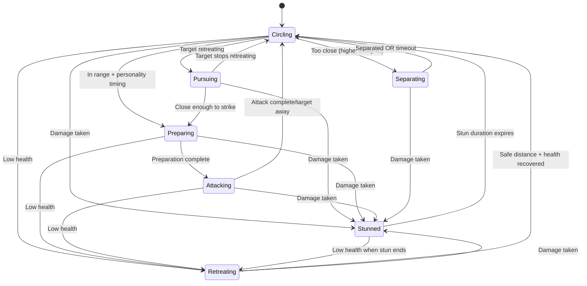

# AI Fighter State Machine

The AI fighter system in 33 Duels implements a sophisticated state machine that governs combat behavior. Each fighter AI entity operates independently, making decisions based on target proximity, health status, and target movement patterns.

## Overview

The AI system is built around the `AIFighter` component and the `sys_ai_fighter` system, providing dynamic combat behavior that scales with movement speed and adapts to different combat scenarios.

### Core Components

- **Component**: `com_ai_fighter.ts` - Defines AI state and personality properties
- **System**: `sys_ai_fighter.ts` - Implements state machine logic
- **States**: Seven distinct behavioral states with clear transitions
- **Personality System**: Aggressiveness and Patience traits affect behavior

## AI States

### 1. Circling 🔄
**Default combat state** - Fighters orbit their target at a safe distance, looking for attack opportunities.

**Behavior:**
- Moves in circular patterns around the target
- Maintains optimal engagement distance
- Randomly changes direction for unpredictability
- Occasionally spirals inward for dramatic tension

**Transitions:**
- → **Pursuing**: When target starts retreating
- → **Preparing**: When within dash range + personality-based timing + cooldown ready
- → **Retreating**: When health drops to low threshold
- → **Stunned**: When taking damage
- → **Separating**: When too close to target (entity priority system)

### 2. Pursuing 🏃‍♂️
**Aggressive chase state** - Direct pursuit of retreating targets with no circling.

**Behavior:**
- Moves directly toward retreating target
- Speed multiplied by Aggressiveness personality trait (1.2x base)
- Shorter attack cooldowns (1.0-1.5s vs 2.0-3.5s)
- No circular movement - pure aggression

**Transitions:**
- → **Preparing**: When close enough to strike (starts attack preparation)
- → **Circling**: When target stops retreating
- → **Stunned**: When taking damage

### 3. Preparing ⚡
**Wind-up state** - Telegraphs incoming dash attacks with dramatic buildup.

**Behavior:**
- Slight oscillating movement toward target direction
- Duration scales with Aggressiveness (more aggressive = faster preparation)
- Base preparation time: 0.8 seconds (scaled by speed)
- Stores attack direction for consistent dash targeting

**Transitions:**
- → **Attacking**: After preparation duration completes
- → **Stunned**: When taking damage
- → **Retreating**: When health drops to low threshold

### 4. Attacking ⚔️
**Combat engagement state** - High-speed dash attacks toward the target.

**Behavior:**
- Direct movement toward target at dramatic high speed
- Speed multiplier scales with Aggressiveness personality trait
- Duration: 1.5 + (0.5 * Aggressiveness) seconds, scaled by speed
- Activates weapon systems when in range

**Transitions:**
- → **Circling**: After attack duration expires or target moves away
- → **Stunned**: When taking damage
- → **Retreating**: When health drops to low threshold

### 5. Retreating 🛡️
**Defensive state** - Moves away from threats when health is low.

**Behavior:**
- Moves directly away from target at reduced speed (0.8x multiplier)
- Triggered when health ≤ 1 HP
- Strategic positioning rather than frantic escape
- Timeout protection: maximum 3.0 seconds to prevent stalemates

**Transitions:**
- → **Circling**: When at safe distance AND health > low threshold OR timeout expires
- → **Stunned**: When taking damage

### 6. Stunned 😵
**Temporary incapacitation** - Brief immobilization after taking damage.

**Behavior:**
- No movement for short duration (0.3 seconds, scaled by speed)
- Provides combat rhythm and counterplay opportunities
- Duration scales with movement speed to maintain consistent feel

**Transitions:**
- → **Circling**: After stun duration expires (unless other conditions apply)
- → **Retreating**: If health is low when stun ends

### 7. Separating 🔄
**Collision avoidance state** - Active separation when fighters get too close.

**Behavior:**
- Asymmetric priority system: only higher entity ID enters this state
- Pushes away from target with strong separation forces
- Timeout protection: maximum 2.0 seconds in this state
- Uses random direction fallback if separation forces cancel out

**Transitions:**
- → **Circling**: When adequately separated OR timeout expires
- → **Stunned**: When taking damage

## Speed Scaling System

The AI system automatically adapts to different movement speeds to maintain consistent gameplay feel:

### Distance Scaling
All distance thresholds scale proportionally with movement speed:
```typescript
let speed_scale = move.MoveSpeed / BASE_MOVE_SPEED; // BASE_MOVE_SPEED = 2.0
let scaled_distances = {
    circle: BASE_CIRCLE_DISTANCE * speed_scale,           // 2.5 → 7.5 at 3x speed
    dash_trigger: BASE_DASH_TRIGGER_DISTANCE * speed_scale * ai.Aggressiveness, // 4.5 → 13.5 at 3x speed
    retreat: BASE_RETREAT_DISTANCE * speed_scale,         // 5.0 → 15.0 at 3x speed
    separation: BASE_SEPARATION_DISTANCE * speed_scale    // 1.2 → 3.6 at 3x speed
};
```

### Time Scaling
State durations scale inversely with speed using square root to moderate the effect:
```typescript
let time_scale = 1.0 / Math.sqrt(speed_scale);
```

This ensures that:
- Faster fighters have shorter state transitions
- Combat pacing remains consistent
- AI responsiveness scales appropriately

### Dash Speed Scaling
Attack movement speed scales with personality and prevents overshooting:
```typescript
let effective_multiplier = BASE_DASH_SPEED_MULTIPLIER * ai.Aggressiveness;
effective_multiplier = Math.min(
    effective_multiplier, 
    BASE_DASH_SPEED_MULTIPLIER * 1.5 / Math.sqrt(speed_scale)
);
```

## Retreat Detection

The AI uses vector dot product calculation to detect when targets are retreating:

```typescript
let target_movement: Vec2 = [target_move.Direction[0], target_move.Direction[1]];
let dot_product = target_movement[0] * to_target[0] + target_movement[1] * to_target[1];
let is_target_retreating = dot_product < -0.3; // Threshold to avoid false positives
```

When retreat is detected:
- **Circling** state immediately transitions to **Pursuing**
- No more defensive circling - pure aggression
- Faster movement and shorter cooldowns

## Personality System

Each fighter has unique personality traits that affect their behavior:

### Aggressiveness (0.5-2.0)
- **Affects**: Attack frequency, dash trigger distance, dash speed, pursuit speed
- **Player Default**: 1.0 (balanced for upgrade system)
- **Opponent Range**: 0.5-2.0 (randomized for variety)

### Patience (0.7-2.0) 
- **Affects**: How long they circle before attacking, attack cooldown duration
- **Player Default**: 1.0 (balanced for upgrade system)  
- **Opponent Range**: 0.7-2.0 (randomized for variety)

### Deterministic Randomness
- Uses sequential random numbers from `lib/random.ts`
- Player fighters have consistent default traits
- Opponent fighters use procedural variation
- Same initial seed = identical duel outcomes

## Victory Behavior

When no valid targets remain (all enemies defeated):
- AI stops all movement completely
- Provides clean victory pose
- Ready for future victory animation integration

## State Transition Diagram



## Key Parameters

| Parameter | Base Value | Description |
|-----------|------------|-------------|
| `BASE_CIRCLE_DISTANCE` | 2.5 | Preferred circling radius |
| `BASE_DASH_TRIGGER_DISTANCE` | 4.5 | Attack initiation range (much longer!) |
| `BASE_SEPARATION_DISTANCE` | 1.2 | Minimum separation to prevent lock-ins |
| `BASE_RETREAT_DISTANCE` | 5.0 | Safe retreat distance |
| `BASE_PREPARE_DURATION` | 0.8 | Wind-up time for dash attacks |
| `LOW_HEALTH_THRESHOLD` | 1 | Health trigger for retreat |
| `BASE_DASH_SPEED_MULTIPLIER` | 4.0 | Attack speed boost (increased) |
| `BASE_MOVE_SPEED` | 2.0 | Reference speed for scaling |

## Implementation Notes

- All states check for target validity (alive enemies)
- State changes are logged for debugging
- Attack cooldowns prevent spam behavior
- Personality traits add variety while maintaining determinism
- Asymmetric separation prevents collision deadlocks
- System designed for hackability and easy modification
- Uses lib/random.ts for deterministic behavior
- Player fighters use consistent defaults for upgrade system

## Collision Avoidance System

The enhanced collision system prevents lock-ins and jiggling:

### Asymmetric Priority
- Only higher entity ID enters "Separating" state
- Lower entity ID stays in "Circling" but moves cooperatively away
- Prevents both fighters from entering separation simultaneously

### Timeout Protection
- Maximum 2.0 seconds in separating state
- Automatic return to circling if separation fails
- Emergency random movement if forces cancel out

### Separation Forces
- Calculated based on distance to all nearby entities
- Applied to all movement states for smooth avoidance
- Normalized and scaled for consistent behavior

The AI state machine provides engaging, dramatic combat with cinematic long-range attacks, proper spacing, and zero deadlocks while maintaining clear, predictable behavior patterns that players can learn and counter.