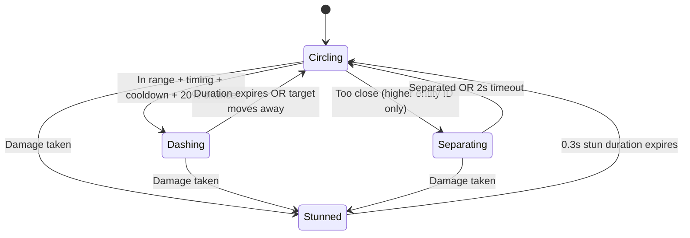

# AI Fighter State Machine

The AI fighter system in 33 Duels implements a sophisticated state machine that governs combat behavior. Each fighter AI entity operates independently, making decisions based on target proximity, health status, and target movement patterns.

## Overview

The AI system is built around the `ControlAi` component and the `sys_control_ai` system, providing dynamic combat behavior that scales with movement speed and adapts to different combat scenarios.

### Core Components

- **Component**: `com_control_ai.ts` - Defines AI state and personality properties
- **System**: `sys_control_ai.ts` - Implements state machine logic
- **States**: Four distinct behavioral states with clear transitions
- **Personality System**: Aggressiveness and Patience traits affect behavior

## AI States

### 1. Circling 🔄

**Default combat state** - Fighters orbit their target at a safe distance, looking for attack opportunities.

**Behavior:**

- Moves in circular patterns around the target
- Maintains optimal engagement distance (BASE_CIRCLE_DISTANCE = 2.5)
- Randomly changes direction (`ai.CircleDirection *= -1`) for unpredictability
- When target is too close, either separates or moves away cooperatively
- When target is separating, backs away with reduced circling

**Movement Logic:**
- Calculates perpendicular vector for circular motion
- Adjusts radial movement based on distance to target
- When target is separating: stronger inward movement (-1.2) with reduced perpendicular (0.3)
- Normal circling: moderate radial movement (0.6) with strong perpendicular (0.7)

**Transitions:**

- → **Dashing**: When within dash range + personality timing + cooldown ready + random chance (20% * Aggressiveness)
- → **Stunned**: When taking damage (within 0.3 seconds)
- → **Separating**: When too close to target (entity priority system: only higher entity ID separates)

### 2. Dashing ⚔️

**Combat engagement state** - High-speed dash attacks toward the target.

**Behavior:**

- Direct movement toward target at dramatically high speed
- Speed multiplier: `BASE_DASH_SPEED_MULTIPLIER * ai.Aggressiveness * (ai.DashSpeedMultiplier || 1)`
- Speed capped to prevent overshooting: `(BASE_DASH_SPEED_MULTIPLIER * 1.5) / sqrt(speed_scale)`
- Duration: `(1.5 + 0.5 * ai.Aggressiveness) * time_scale` seconds
- Activates melee weapon systems when in range

**Transitions:**

- → **Circling**: After dash duration expires OR target moves too far away (> 1.5x dash trigger distance)
- → **Stunned**: When taking damage

### 3. Stunned 😵

**Temporary incapacitation** - Brief immobilization after taking damage.

**Behavior:**

- No movement for short duration (0.3 seconds, scaled by time_scale)
- Triggered automatically when `game.Time - health.LastDamageTime < 0.3 * time_scale`
- Provides combat rhythm and counterplay opportunities
- Duration scales with movement speed to maintain consistent feel

**Transitions:**

- → **Circling**: After stun duration expires (0.3 * time_scale)

### 4. Separating 🔄

**Collision avoidance state** - Active separation when fighters get too close.

**Behavior:**

- Asymmetric priority system: only higher entity ID (`entity > aim.TargetEntity`) enters this state
- Moves in random direction to break deadlock situations
- Random angle generation: `float(0, Math.PI * 2)` for unpredictable movement
- Enhanced movement speed (1.2x) to quickly exit close-range situations
- Timeout protection: maximum 2.0 seconds in this state

**Transitions:**

- → **Circling**: When adequately separated (> 1.5x separation distance) OR timeout expires
- → **Stunned**: When taking damage

## Speed Scaling System

The AI system automatically adapts to different movement speeds to maintain consistent gameplay feel:

### Distance Scaling

All distance thresholds scale proportionally with movement speed:

```typescript
let speed_scale = move.MoveSpeed / BASE_MOVE_SPEED; // BASE_MOVE_SPEED = 2.0
let scaled_distances = {
    circle: BASE_CIRCLE_DISTANCE * speed_scale, // 2.5 → 7.5 at 3x speed
    dash_trigger: BASE_DASH_TRIGGER_DISTANCE * speed_scale * ai.Aggressiveness, // 4.5 → 13.5 at 3x speed
    retreat: BASE_RETREAT_DISTANCE * speed_scale, // 5.0 → 15.0 at 3x speed
    separation: BASE_SEPARATION_DISTANCE * speed_scale, // 1.2 → 3.6 at 3x speed
};
```

### Time Scaling

State durations scale inversely with speed using square root to moderate the effect:

```typescript
let time_scale = 1.0 / Math.sqrt(speed_scale);
```

This ensures that:

- Faster fighters have shorter state transitions
- Combat pacing remains consistent
- AI responsiveness scales appropriately

### Dash Speed Scaling

Attack movement speed scales with personality and prevents overshooting:

```typescript
let effective_multiplier = BASE_DASH_SPEED_MULTIPLIER * ai.Aggressiveness;
effective_multiplier = Math.min(
    effective_multiplier,
    (BASE_DASH_SPEED_MULTIPLIER * 1.5) / Math.sqrt(speed_scale),
);
```

## Movement Speed and Energy System

The AI system includes dynamic movement speed based on energy levels:

```typescript
move.MoveSpeed = ai.BaseMoveSpeed * Math.sqrt(ai.Energy);
```

**Energy Effects:**
- Movement speed scales with square root of energy level
- Provides visual feedback through speed changes
- Integrates with upgrade systems like Kinetic Charger

**Kinetic Charger Integration:**
- When moving, AI gains energy: `ai.Energy += (move.MoveSpeed / 4) * 0.5 * delta`
- Rewards active movement and combat engagement
- Creates positive feedback loop for aggressive play

## Personality System

Each fighter has unique personality traits that affect their behavior:

### Aggressiveness (0.5-2.0)

- **Affects**: Attack frequency, dash trigger distance, dash speed, pursuit speed
- **Player Default**: 1.0 (balanced for upgrade system)
- **Opponent Range**: 0.5-2.0 (randomized for variety)

### Patience (0.7-2.0)

- **Affects**: How long they circle before attacking, attack cooldown duration
- **Player Default**: 1.0 (balanced for upgrade system)
- **Opponent Range**: 0.7-2.0 (randomized for variety)

### Deterministic Randomness

- Uses sequential random numbers from `lib/random.ts`
- Player fighters have consistent default traits
- Opponent fighters use procedural variation
- Same initial seed = identical duel outcomes

## Victory Behavior

When no valid targets remain (all enemies defeated):

- AI stops all movement completely
- Provides clean victory pose
- Ready for future victory animation integration

## State Transition Diagram



## Key Parameters

| Parameter                    | Base Value | Description                            |
| ---------------------------- | ---------- | -------------------------------------- |
| `BASE_CIRCLE_DISTANCE`       | 2.5        | Preferred circling radius              |
| `BASE_DASH_TRIGGER_DISTANCE` | 4.5        | Attack initiation range                |
| `BASE_SEPARATION_DISTANCE`   | 1.2        | Minimum separation to prevent lock-ins |
| `BASE_DASH_SPEED_MULTIPLIER` | 4.0        | Attack speed boost multiplier          |
| `BASE_MOVE_SPEED`            | 2.0        | Reference speed for scaling            |

## Implementation Notes

- All states check for target validity (`aim.TargetEntity === -1`)
- Attack cooldowns prevent spam behavior (`ai.AttackCooldown`)  
- Personality traits add variety while maintaining determinism
- Asymmetric separation prevents collision deadlocks (entity ID priority)
- System designed for hackability and easy modification
- Uses lib/random.ts for deterministic behavior (`float()` function)
- Player fighters use consistent defaults for upgrade system
- **Energy integration**: Movement speed scales with energy level and upgrades
- **Berserker mode**: Speed bonus when health drops below threshold
- **Kinetic Charger**: Movement generates energy for sustained combat

## Collision Avoidance System

The enhanced collision system prevents lock-ins and jiggling:

### Asymmetric Priority

- Only higher entity ID enters "Separating" state
- Lower entity ID stays in "Circling" but moves cooperatively away
- Prevents both fighters from entering separation simultaneously

### Timeout Protection

- Maximum 2.0 seconds in separating state
- Automatic return to circling if separation fails
- Emergency random movement if forces cancel out

### Separation Forces

- Calculated based on distance to all nearby entities
- Applied to all movement states for smooth avoidance
- Normalized and scaled for consistent behavior

The AI state machine provides engaging, dramatic combat with cinematic long-range attacks, proper spacing, and zero deadlocks while maintaining clear, predictable behavior patterns that players can learn and counter.
